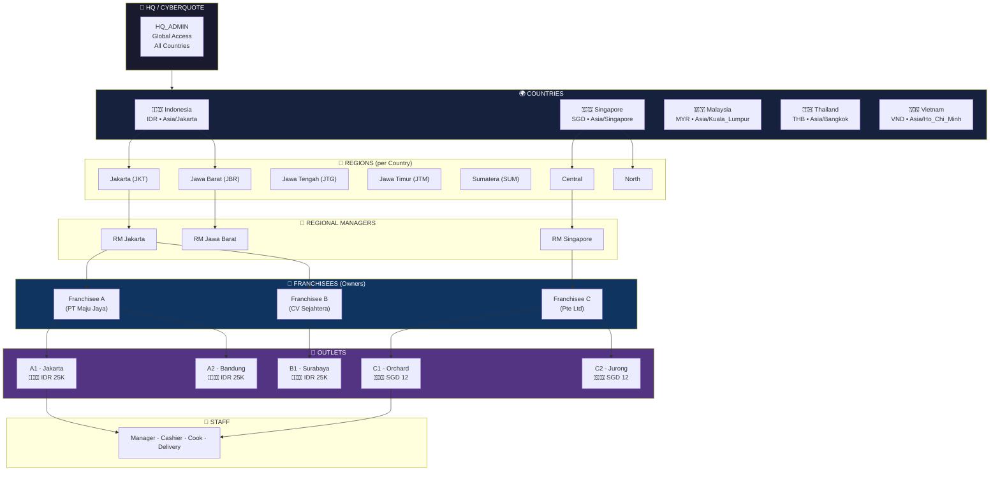
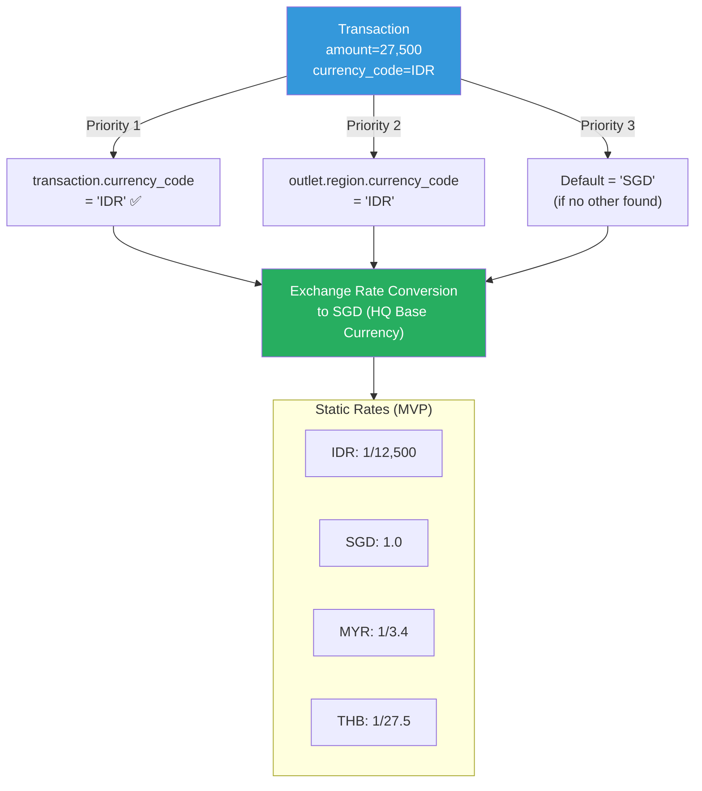
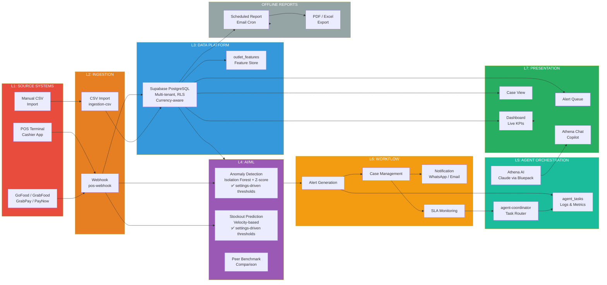

# CQaiFranchise — System Architecture
**Project:** CQaiFranchise by Cyberquote
**Version:** 3.0
**Date:** 11 August 2026
**Status:** Active Development — Multi-Country Ready

---

## 1. Executive Summary

CQaiFranchise is an **AI-powered franchise operations monitoring platform** built for multi-country franchise networks. It provides real-time anomaly detection, automated workflow, and AI-driven insights for franchise owners and operators.

**Core capability:** Real-time POS data → AI anomaly detection → Automated case management → Stakeholder notifications

| Layer | Name | Completion |
|-------|------|-----------|
| L1 | Source Systems | 70% |
| L2 | Ingestion | 85% |
| L3 | Data Platform | 95% |
| L4 | AI/ML | 75% |
| L5 | Agent Orchestration | 45% |
| L6 | Workflow Automation | 40% |
| L7 | Presentation | 88% |

---

## 2. Multi-Country Hierarchy

CQaiFranchise operates across **multiple countries**, each with **multiple regions**, enabling franchise networks to monitor their entire operation from a single platform.



---

## 3. Stakeholders

### 🟢 LIVE STAKEHOLDERS (Daily App Users)

Users who **access the web dashboard daily** and see data **in real-time**.

| Role | Access | View | Frequency |
|------|--------|------|-----------|
| **HQ Admin** | Web Dashboard | All countries, all regions, all outlets | Daily |
| **Regional Manager** | Web Dashboard | Own region only (all franchisees) | Daily |
| **Franchisee Owner** | Web Dashboard | Own outlets only | Daily |
| **Outlet Manager** | Web Dashboard | Single outlet | Daily |
| **POS Cashier** | POS Terminal | Transaction entry only | Every transaction |
| **AI Agent (Athena)** | Background | Alert triage, case routing | Automated |

**How they get data:** Live web dashboard, real-time updates
**Data freshness:** Instant (within seconds)

### 🔴 OFFLINE STAKEHOLDERS (Report Consumers)

Users who **never log in** to the app — they receive **scheduled reports** via email.

| Role | Receives | Format |
|------|----------|--------|
| **HQ / Franchisor Owner** | Weekly summary: revenue, alerts, outlet rankings | Email + PDF |
| **Investor / Board** | Monthly performance report: KPIs, growth, compliance | Email + PDF |
| **Finance Team** | Monthly financial breakdown by country/region | Spreadsheet |
| **Compliance Team** | Monthly SLA compliance report | Email + PDF |

**How they get data:** Scheduled email reports (daily/weekly/monthly)
**Data freshness:** End-of-day or end-of-week

### 📊 Data Access Matrix

| Stakeholder | Live Dashboard | Email Report | API | POS Entry |
|-------------|:--------------:|:-----------:|:---:|:---------:|
| HQ Admin | ✅ | ✅ (weekly) | ✅ | ❌ |
| Regional Manager | ✅ | ✅ (daily) | ✅ | ❌ |
| Franchisee Owner | ✅ | ✅ (daily) | ✅ | ❌ |
| Outlet Manager | ✅ | ❌ | ✅ | ❌ |
| POS Cashier | ❌ | ❌ | ❌ | ✅ |
| AI Agent | Background | ❌ | ❌ | ❌ |
| Investor | ❌ | ✅ (weekly PDF) | ❌ | ❌ |

---

## 4. Multi-Currency System

### Design: Hybrid Currency Resolution

Each transaction stores its own currency. Dashboard converts to SGD for HQ reporting.



### Currency Configuration

| Country | Currency | Code | Rate to SGD | Symbol | Timezone |
|---------|---------|------|-------------|--------|----------|
| Indonesia | Rupiah | IDR | 12,500 | Rp | Asia/Jakarta |
| Singapore | Singapore Dollar | SGD | 1.0 | S$ | Asia/Singapore |
| Malaysia | Ringgit | MYR | 3.4 | RM | Asia/Kuala_Lumpur |
| Thailand | Baht | THB | 27.5 | ฿ | Asia/Bangkok |
| Vietnam | Dong | VND | 25,000 | ₫ | Asia/Ho_Chi_Minh |

### Data Flow

```
1. POS Terminal sends: amount=27500, currency_code=IDR
       │
2. pos-webhook edge function
       │  - Validates HMAC signature
       │  - Looks up outlet.region_id → region.currency_code (fallback)
       │  - Inserts: amount=27500, currency_code=IDR
       ▼
3. sales_transactions (DB)
       │  - currency_code stored per row ✅
       ▼
4. dashboard-full edge function
       │  - Reads: txn.currency_code OR outlet.currency
       │  - Converts: amount × rate[IDR] = S$2.20
       ▼
5. Dashboard shows: S$ 2.20 (HQ base currency)
```

---

## 5. End-to-End Data Flow



---

## 6. Database Schema

### Entity Relationship

```mermaid
erDiagram
    COUNTRIES {
        int id PK
        string name
        string code UK "ID/SG/MY/TH/VN"
        string currency_code
        string timezone
        boolean is_active
        timestamp created_at
    }

    REGIONS {
        int id PK
        int country_id FK
        string name
        string code UK
        string currency_code "Inherited from country"
        boolean is_active
        timestamp created_at
    }

    USER_PROFILES {
        uuid id PK
        int region_id FK "nullable — HQ users"
        int country_id FK "nullable — HQ users"
        string full_name
        string phone
        user_role role
        boolean is_active
        timestamp created_at
    }

    OUTLETS {
        int id PK
        int region_id FK
        uuid franchisee_id FK "user_profiles"
        string name
        string code UK
        string address
        string city
        outlet_status status
        decimal daily_target "local currency"
        timestamp created_at
    }

    SALES_TRANSACTIONS {
        bigint id PK
        int outlet_id FK
        string transaction_id UK
        date date
        decimal amount "in local currency"
        string currency_code "IDR/SGD/MYR/THB/VND ✅"
        decimal settlement_amount
        int transaction_count
        int hour
        int day_of_week
        decimal anomaly_score
        boolean is_anomaly
        jsonb metadata
        timestamp created_at
    }

    STAFF_ASSIGNMENTS {
        int id PK
        uuid user_id FK
        int outlet_id FK
        staff_role role
        boolean is_active
        timestamp created_at
    }

    INVENTORY {
        int id PK
        int outlet_id FK
        string sku
        string product_name
        int current_stock
        int min_stock
        int max_stock
        timestamp updated_at
    }

    ALERTS {
        int id PK
        int outlet_id FK
        alert_type type
        alert_severity severity
        alert_status status
        string title
        text description
        decimal score
        timestamp triggered_at
        timestamp resolved_at
    }

    CASES {
        int id PK
        int alert_id FK
        uuid assigned_to_id FK
        case_priority priority
        case_status status
        timestamp sla_deadline
        timestamp resolved_at
        timestamp created_at
    }

    NOTIFICATIONS {
        int id PK
        int alert_id FK
        uuid user_id FK
        notification_channel channel
        notification_status status
        text message
        timestamp sent_at
    }

    AGENTS {
        int id PK
        string name
        string agent_type
        boolean is_active
        timestamp last_seen
    }

    AGENT_TASKS {
        uuid id PK
        int agent_id FK
        string task_type
        string status
        jsonb input_payload
        jsonb output_payload
        timestamp started_at
        timestamp completed_at
    }

    ML_MODEL_VERSIONS {
        int id PK
        string model_name
        string version
        string model_type
        jsonb metrics
        boolean is_production
        timestamp trained_at
    }

    ML_PREDICTIONS {
        int id PK
        int outlet_id FK
        int model_version_id FK
        string prediction_type
        decimal score
        boolean is_anomaly
        date prediction_date
    }

    COUNTRIES ||--o{ REGIONS : has
    REGIONS ||--o{ OUTLETS : has
    REGIONS ||--o{ USER_PROFILES : has
    USER_PROFILES ||--o{ OUTLETS : owns
    USER_PROFILES ||--o{ STAFF_ASSIGNMENTS : assigned
    OUTLETS ||--o{ STAFF_ASSIGNMENTS : has
    OUTLETS ||--o{ SALES_TRANSACTIONS : generates
    OUTLETS ||--o{ INVENTORY : has
    OUTLETS ||--o{ ALERTS : triggers
    OUTLETS ||--o{ ML_PREDICTIONS : predicted
    ALERTS ||--o{ CASES : creates
    ALERTS ||--o{ NOTIFICATIONS : triggers
    USER_PROFILES ||--o{ CASES : assigned
    USER_PROFILES ||--o{ NOTIFICATIONS : receives
    ML_MODEL_VERSIONS ||--o{ ML_PREDICTIONS : used_by
```



---

## 7. Access Control Matrix

| Role | Countries | Regions | Own Outlets | All Outlets | Reports | Admin |
|------|:---------:|:-------:|:-----------:|:-----------:|:---------:|:------:|
| **HQ_ADMIN** | All | All | — | ✅ | ✅ | ✅ |
| **REGIONAL_MANAGER** | Own country | Own region | — | ✅ | ✅ | ❌ |
| **FRANCHISEE_OWNER** | Own country | — | ✅ | ❌ | ✅ | ❌ |
| **FRANCHISEE_STAFF** | Own country | — | Assigned outlet | ❌ | ❌ | ❌ |

---

## 8. Technology Stack

| Layer | Technology | Purpose |
|-------|-----------|---------|
| Frontend | React 19, Vite, TailwindCSS, Recharts | Web dashboard |
| Backend | Supabase Edge Functions (Deno/TypeScript) | Serverless API |
| Database | Supabase PostgreSQL | Multi-tenant DB, RLS |
| AI | Claude via Bluepack (ai.bluepack.my.id) | NLP, explanations |
| Auth | Supabase Auth (JWT) | User authentication |
| Hosting | Vercel (frontend), Supabase (backend) | Deployment |
| Database ID | `ploqeifazcgzwjzmukgp` | Supabase project |

---

## 9. Edge Functions

### Active Functions

```
supabase/functions/
├── POS / Ingestion (L1-L2)
│   ├── pos-webhook/           ✅ Currency-aware (auto-tag currency_code)
│   ├── pos-connector/         ✅ POS config
│   ├── ingestion-webhook/    ✅ Generic webhook
│   └── ingestion-csv/         ✅ CSV batch import
│
├── Dashboard (L3-L4)
│   ├── dashboard-full/        ✅ Main dashboard (hybrid currency resolution)
│   ├── dashboard-api/        ✅ Dashboard API
│   ├── dashboard-stats/       ✅ Stats aggregation
│   └── dashboard-kpis/       ✅ KPI cards
│
├── ML Pipeline (L4)
│   ├── coordinator-pipeline/  ✅ ML orchestrator (z-score → alert)
│   ├── ml-anomaly-v2/       ✅ Anomaly detection (Isolation Forest, settings-driven)
│   ├── ml-stockout-v2/       ✅ Stockout prediction (velocity-based, settings-driven)
│   ├── ml-batch-score/       ✅ Batch scoring
│   ├── peer-benchmark/       ✅ Peer comparison
│   └── ml-accuracy-tracker/  ✅ Model accuracy
│
├── AI / Athena (L5-L7)
│   ├── athena-chat/          ✅ AI chat (Claude via Bluepack)
│   ├── athena-insights/       ✅ AI-generated insights
│   ├── athena-case-triage/   ✅ Case triage
│   └── hermes-query/         ✅ Query interface
│
├── Agent Orchestration (L5)
│   ├── agent-coordinator/     ✅ Task router
│   ├── agent-orchestration/  ✅ Agent status (real DB)
│   ├── agent-status/          ✅ Agent health
│   └── agents-list/          ✅ List agents
│
├── Workflow (L6)
│   ├── alerts-list/          ✅ Alert queue
│   ├── alert-generator/       ✅ Generate alerts
│   ├── alert-update/        ✅ Update alert
│   ├── case-create/          ✅ Create case
│   ├── case-assigner/        ✅ Assign case
│   ├── case-update/          ✅ Update case
│   ├── cases-list/           ✅ Case list
│   ├── sla-escalator/        ✅ SLA monitoring
│   └── notification-send/      ✅ Send notification
│
├── Financing
│   ├── repayment-risk-scorer/ ✅ Loan risk scoring
│   ├── repayment-alert-generator/
│   └── lender-bridge/
│
├── Reference Data
│   ├── franchises-list/       ✅ Franchise list
│   ├── regions-list/         ✅ Regions
│   ├── staff-list/           ✅ Staff
│   ├── inventory-api/         ✅ Inventory
│   └── settings-get/save/     ✅ Settings
│
├── System
│   ├── health-check/         ✅ Health endpoint
│   ├── db-stats/            ✅ DB statistics
│   ├── data-quality-monitor/ ✅ Data quality
│   ├── cron-run/             ✅ Cron runner
│   └── seed-*/               ✅ Seed data (12+ files)
│
└── _shared/
    └── auth-helpers/
```

---

## 10. React Components

```
src/components/
├── Core
│   ├── Dashboard.tsx           ✅ Main dashboard (currency display)
│   ├── Layout.tsx            ✅ Sidebar + header
│   └── LiveTransactionFeed.tsx ✅ Real-time feed
│
├── Workflow
│   ├── AlertsList.tsx       ✅ Alert queue
│   ├── CasesList.tsx        ✅ Case management
│   ├── ApprovalWorkflows.tsx ✅ Approvals
│   └── Workflows.tsx          ✅ Workflow management
│
├── AI / Chat (Athena)
│   ├── FloatingChat.tsx      ✅ Floating AI button
│   ├── ChatPanel.tsx         ✅ Full chat panel
│   ├── AICopilot.tsx         ✅ Embedded copilot
│   └── KnowledgeBaseAdmin.tsx ✅ KB management
│
├── Reports
│   ├── RiskDashboard.tsx    ✅ Risk overview
│   ├── PeerBenchmark.tsx     ✅ Peer comparison
│   └── Financing.tsx         ✅ Financing module
│
├── Entities
│   ├── Outlets.tsx          ✅ Outlet management
│   ├── Workforce.tsx         ✅ Staff management
│   └── Models.tsx            ✅ ML models
│
├── System
│   ├── Integrations.tsx     ✅ POS connectors
│   ├── Settings.tsx           ✅ Settings
│   ├── AccessManagement.tsx  ✅ Access control
│   └── LanguageSwitcher.tsx  ✅ i18n
│
└── Auth
    └── Login.tsx            ✅ Login
```

---

## 11. Data Quality Status

```
sales_transactions:
├── Total rows: 74,498 ✅
├── Currency tagged: IDR (all) ✅
├── Date range: 2026-01-01 → 2026-08-11 ✅
└── Outlets: 20 (IDs: 1-8, 11, 12, 22, 24, 164-171)

Currency conversion (dashboard):
├── Stored: Rp 5,259,985,011
├── Rate: ÷12,500
└── Dashboard shows: ~S$ 420,800 ✅ (not S$ 590M)
```

---

## 12. Known Issues

| # | Issue | Status |
|---|-------|--------|
| 1 | Outlet assignments (some tagged SGD instead of IDR) | ⚠️ Fix in progress |
| 2 | User profiles have placeholder UUIDs | ⚠️ Needs real auth.users |
| 3 | SUPABASE_SERVICE_ROLE_KEY = anon key | ⚠️ Needs correct SR key |
| 4 | No countries table (multi-country hierarchy) | ⏳ Planned |
| 5 | ML thresholds hardcoded (not settings-driven) | ✅ FIXED Aug 2026 |
| 6 | Repayment risk CRITICAL < HIGH bug | ✅ FIXED Aug 2026 |

---

## 13. MVP vs Production Path

```
MVP (Now → 4 weeks)
├── Indonesia only (IDR)
├── 1 franchise, 20 outlets
├── Z-score anomaly detection
├── Basic case workflow
├── Athena Chat
└── Dashboard with currency conversion

Production (12-16 weeks)
├── Multi-country (ID/SG/MY/TH/VN)
├── Multi-franchise, 100+ outlets
├── Real POS integrations (Moka, GoFood, GrabFood)
├── Full AI orchestration (Hermes Agent)
├── SLA enforcement + audit log
└── PDF reports + mobile app
```

---

*Last updated: August 11, 2026*
*Author: Cyberquote Engineering Team*
