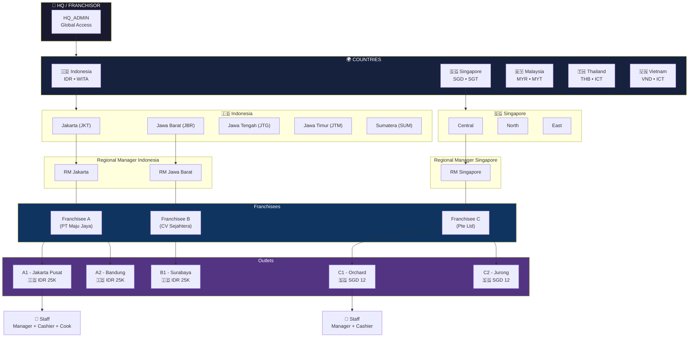
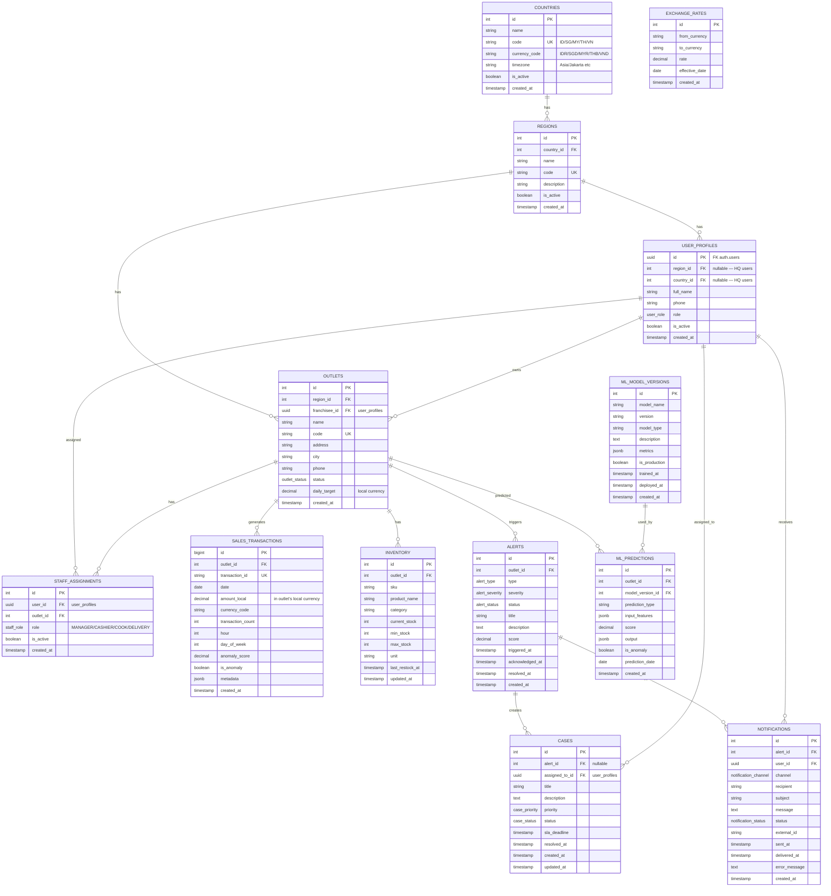
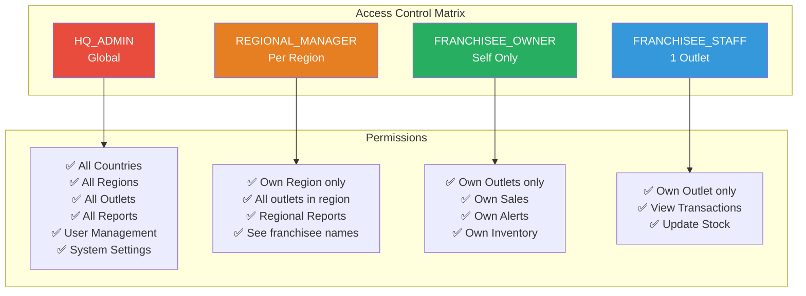
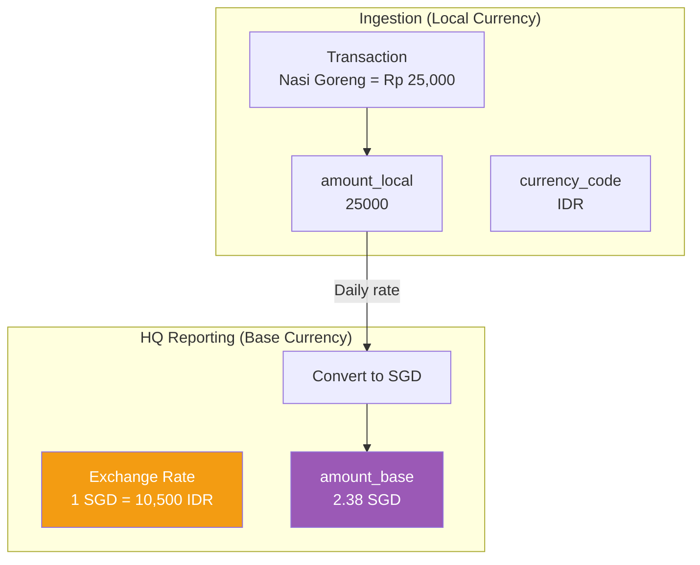

# CQaiFranchise — Multi-Country Franchise Management System

## Vision

> Sistem monitoring franchise berbasis AI untuk Franchisor yang beroperasi di
> **multi-country** (Indonesia, Singapore, Malaysia, Thailand, Vietnam).
> Memberikan real-time visibility ke seluruh jaringan outlets, anomaly detection
> otomatis, dan case management untuk franchisee management.

**Target:** SaaS subscription untuk Franchisor (bukan franchisee). **Model:** HQ
→ Countries → Regions → Regional Managers → Franchisees → Outlets → Staff

---

## Business Context

### Franchise Business Model

```
FRANCHISOR (Pemilik Brand / HQ)
├── Set brand standards, SOP, menu
├── Monitoring seluruh outlets
├── Set fee, royalty, support
└── Collect data → AI insights

FRANCHISEE (Mitra)
├── Beli lisensi → buka outlets
├── Bisa punya 1..N outlets di 1..N regions
├── Responsible: daily ops, staffing, cash flow
└── Bayar royalty ke Franchisor
```

### Current State

- Single-country prototype (Indonesia only, IDR)
- Schema lama: `regions` (Indonesia provinces) tanpa `countries` table
- No real users (auth.users empty)
- sales_transactions: 37K rows tapi FK ke outlets kosong
- Multi-country redesign needed

---

## Multi-Country Hierarchy



### Ownership & Reporting Lines

```
OWNERSHIP (business relationship):
  Franchisee owns Outlets
  HQ owns Country strategy

REPORTING (data access):
  HQ sees everything
  Regional Manager sees all outlets in their region (from all franchisees)
  Franchisee sees their own outlets only
  Staff sees their own outlet only
```

---

## Database Schema

### Entity Relationship



---

## Access Control Matrix



---

## Data Flow

```mermaid
graph LR
    POS["POS Terminal<br/>📱 Cashier App"]
    WEBHOOK["Webhook → Edge Function"]
    INGEST["Ingestion Pipeline"]
    ML["ML Anomaly Detection"]
    DASH["Dashboard"]
    ALERT["Alert System"]
    CASES["Case Management"]
    NOTIFY["Notify Franchisee"]
    FRAN["Franchisee Owner"]

    POS -->|"Transaction JSON"| WEBHOOK
    WEBHOOK -->|"Validate + Transform"| INGEST
    INGEST -->|"sales_transactions"| ML
    ML -->|"anomaly_score, is_anomaly"| DASH
    ML -->|"score > threshold"| ALERT
    ALERT -->|"Create Alert"| CASES
    CASES -->|"Assign"| NOTIFY
    NOTIFY -->|"WhatsApp/Email/SMS"| FRAN
```



### Multi-Currency Processing



---

## Country Configuration

| Country   | Code | Currency | Symbol | Timezone                | Payment Methods              |
| --------- | ---- | -------- | ------ | ----------------------- | ---------------------------- |
| Indonesia | ID   | IDR      | Rp     | Asia/Jakarta (WIB)      | QRIS, Cash, GoPay, OVO, Dana |
| Singapore | SG   | SGD      | S$     | Asia/Singapore (SGT)    | PayNow, Cash, GrabPay        |
| Malaysia  | MY   | MYR      | RM     | Asia/Kuala_Lumpur (MYT) | DuitNow, Cash, Touch'n Go    |
| Thailand  | TH   | THB      | ฿      | Asia/Bangkok (ICT)      | PromptPay, Cash              |
| Vietnam   | VN   | VND      | ₫      | Asia/Ho_Chi_Minh (ICT)  | MoMo, VNPay, Cash            |

---

## Key Design Decisions

### 1. Currency Strategy

**Decision:** Store all amounts in local currency. Convert to base currency
(SGD) only for HQ reporting.

**Rationale:**

- Franchisees operate in local currency → simplicity
- Avoid rounding errors in transaction data
- Exchange rates change daily → store in `exchange_rates` table
- HQ dashboard converts on-the-fly for comparison

**Trade-offs:**

- Real-time conversion needs FX API or daily rate updates
- Historical reports need point-in-time exchange rates

### 2. User Authentication

**Decision:** Use Supabase Auth for all users. HQ creates user → invite via
email.

**User flow:**

1. HQ Admin creates user via dashboard
2. Email invite → user sets password
3. `auth.users` created → `user_profiles` auto-created via trigger
4. HQ Admin assigns role, region, country

### 3. Staff Management

**Decision:** Staff assigned to outlets via `staff_assignments` junction table
(many-to-many via user_profiles).

**Rationale:**

- Staff can work at multiple outlets (e.g., floating staff)
- Role is per-outlet (cashier at Outlet A, cook at Outlet B)

### 4. Franchisee Multi-Region

**Decision:** A franchisee can own outlets across multiple regions and
countries.

**Schema:**

- `outlets.franchisee_id` → points to `user_profiles` (franchisee)
- `outlets.region_id` → geographic region
- No restriction on franchisee → region relationship

### 5. ML Pipeline Per Country

**Decision:** Train separate models per country (or per currency zone).

**Rationale:**

- Spending patterns differ by country/culture
- Singapore outlets: higher average transaction, different peak hours
- Indonesia: weekend vs weekday patterns differ by region

---

## Implementation Phases

### Phase 1: Schema Migration (Week 1-2)

- [ ] Add `countries` table
- [ ] Add `staff_assignments` table
- [ ] Add `exchange_rates` table
- [ ] Add `currency_code` to `outlets`
- [ ] Add `amount_local` + `currency_code` to `sales_transactions`
- [ ] Drop old `regions` seed data (Indonesia-only)
- [ ] Seed countries: ID, SG, MY
- [ ] Seed regions per country

### Phase 2: Auth & User Management (Week 2-3)

- [ ] Configure Supabase Auth
- [ ] Update `user_profiles` trigger (add country_id)
- [ ] Update RLS policies for multi-country
- [ ] Create HQ Admin dashboard
- [ ] Create user invitation flow

### Phase 3: Seed Data (Week 3-4)

- [ ] Seed regions (ID: 5, SG: 3, MY: 3)
- [ ] Seed franchisees per region
- [ ] Seed outlets per franchisee
- [ ] Fix `sales_transactions` FK → real outlet_ids
- [ ] Seed realistic POS data per country (with correct currency)

### Phase 4: Dashboard & Reporting (Week 4-6)

- [ ] Multi-country dashboard (country filter)
- [ ] Currency conversion on dashboard
- [ ] Region drill-down
- [ ] HQ consolidated report (SGD base)

### Phase 5: ML Pipeline (Week 6-8)

- [ ] Per-country anomaly detection
- [ ] Retrain models with multi-country data
- [ ] Accuracy tracking per country

---

## Issues to Fix (Immediate)

| Priority | Issue                                  | Fix                                |
| -------- | -------------------------------------- | ---------------------------------- |
| P0       | `regions` table empty                  | Seed Indonesia + Singapore first   |
| P0       | `outlets` table empty                  | Seed outlets linked to regions     |
| P0       | `sales_transactions` FK broken         | Re-seed with real outlet_ids       |
| P0       | `SUPABASE_SERVICE_ROLE_KEY` = anon key | Replace with real service role key |
| P1       | Amount mismatch (IDR vs USD)           | Fix POS backfill amount formula    |
| P1       | `user_profiles` has fake UUIDs         | Reset + use real auth.users        |
| P2       | No exchange_rates table                | Add + seed daily rates             |
| P2       | Staff assignments missing              | Add `staff_assignments` table      |

---

## Open Questions

1. **Country first?** Indonesia only (MVP) or start with 2 countries?
2. **Base currency?** SGD or keep flexible?
3. **HQ location?** Singapore or Indonesia?
4. **Payment gateway per country?** Integrate local payment APIs?
5. **Menu pricing?** Different price per country or same menu, different
   currency?

---

_Last updated: August 11, 2026_ _Author: ERP Team_
