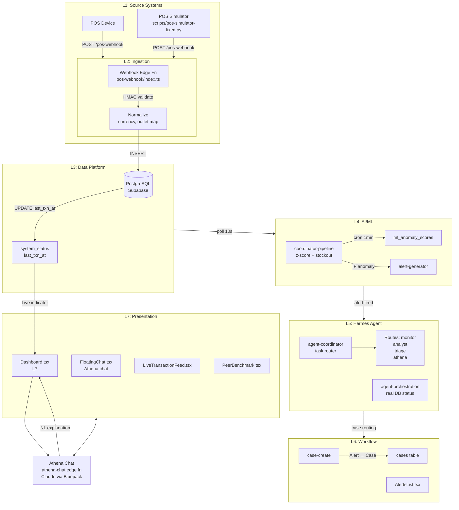

# Architecture — CQaiFranchise

## System Overview

React SPA frontend (Vercel) + Supabase backend (Edge Functions + PostgreSQL). Real-time via polling (no WebSockets). AI via Claude/Bluepack. 99 edge functions, 24 React components, 52 DB migrations.

## Components

- **Frontend** — React 19 + Vite + TailwindCSS + Recharts. Vercel-hosted SPA.
- **Backend** — Supabase Edge Functions (Deno/TypeScript). 99 functions covering L2–L6.
- **Database** — Supabase PostgreSQL. 37+ tables with RLS. Multi-tenant via `tenant_id`/`user_outlets` junction.
- **AI** — Claude via Bluepack proxy (ai.bluepack.my.id). Powers Athena chat.
- **Auth** — Supabase Auth (email/password + JWT).
- **Alt Backend** — Python FastAPI in `backend/` directory (not deployed, future).

## System Diagram

## Data Flow

1. **L1→L2** — POS Simulator or real POS sends POST to `pos-webhook`. HMAC signature validated in dev mode via `x-pos-dev-bypass`.
2. **L2→L3** — Edge function normalizes: maps `outlet_id`, extracts `hour`/`day_of_week`, computes `net_amount`/`settlement_amount`/`profit`. Inserts into `sales_transactions`.
3. **L3** — `system_status.last_txn_at` updated. Dashboard polls this table every 10s → Live indicator.
4. **L4 (cron)** — `coordinator-pipeline` runs every 1 min via Supabase cron. Z-score anomaly detection (today vs 30-day rolling avg). Stockout prediction (7-day risk). Generates alerts if thresholds breached.
5. **L5** — `agent-coordinator` routes tasks: `anomaly_check→monitor`, `user_query→athena`, `alert_triage→triage`. `agent-orchestration` shows real agent status from DB.
6. **L6** — Alert created → User can click → `case-create` → Case assigned to outlet owner.
7. **L7** — Dashboard shows KPIs, chart, live feed. Athena Chat explains anomalies via Claude.

## Key Design Decisions

- **No WebSockets** — polling every 10s for live indicator and transactions. Sufficient for F&B monitoring cadence.
- **Deno Edge Functions** — serverless, fast cold start, native Supabase client. Chosen over Python for consistency with Supabase ecosystem.
- **Currency normalization at query time** — amounts stored in local currency (SGD/IDR/THB/MYR). Dashboard-full edge function converts to SGD using FX rates at query time.
- **Simulator as L1 proxy** — `pos-simulator-fixed.py` mirrors real POS payload shape. Not a production L1, but enables full-stack dev without live POS hardware.
- **RLS per table** — service_role bypass for edge functions, anon_key for user-facing reads with tenant scoping.
- **Python backend idle** — `backend/` exists but is not deployed. FastAPI + asyncpg stack ready for future migration if Supabase Edge Functions prove insufficient.

## Tech Stack

| Layer | Tech |
|-------|------|
| Frontend | React 19, Vite, TailwindCSS, Recharts |
| Backend | Supabase Edge Functions (Deno/TypeScript) |
| Database | Supabase PostgreSQL (37 tables, RLS) |
| AI | Claude via Bluepack (ai.bluepack.my.id) |
| Auth | Supabase Auth (JWT) |
| Hosting | Vercel (frontend), Supabase (backend) |
| Alt Backend | Python FastAPI (idle, not deployed) |

## Database ID

`ploqeifazcgzwjzmukgp` (Supabase project)

## Repository

`github.com/gilangchresna/CQaiFranchise`
