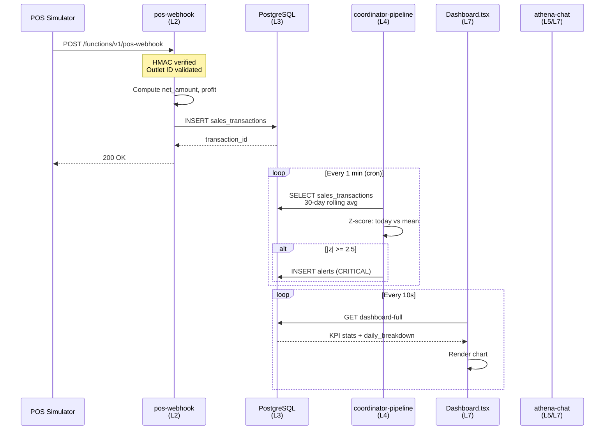
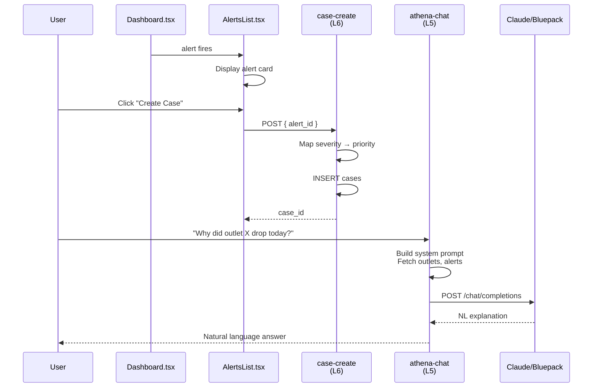
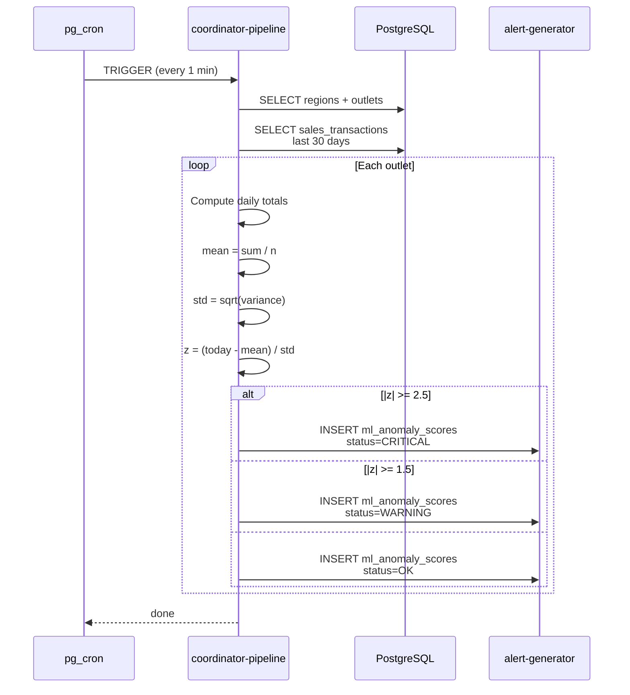
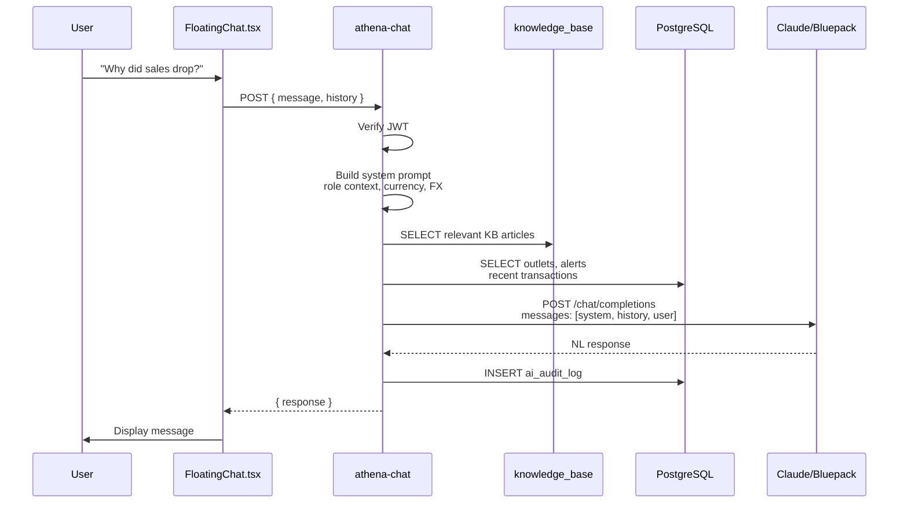

# Sequence Diagrams

## Workflow: POS Transaction → Dashboard

```mermaid
sequenceDiagram
    participant POS as POS Simulator
    participant WH as pos-webhook<br/>(L2)
    participant PG as PostgreSQL<br/>(L3)
    participant Pipe as coordinator-pipeline<br/>(L4)
    participant Dash as Dashboard.tsx<br/>(L7)
    participant Athena as athena-chat<br/>(L5/L7)

    POS->>WH: POST /functions/v1/pos-webhook
    Note over WH: HMAC verified<br/>Outlet ID validated
    WH->>WH: Compute net_amount, profit
    WH->>PG: INSERT sales_transactions
    PG-->>WH: transaction_id
    WH-->>POS: 200 OK

    loop Every 1 min (cron)
        Pipe->>PG: SELECT sales_transactions<br/>30-day rolling avg
        Pipe->>Pipe: Z-score: today vs mean
        alt |z| >= 2.5
            Pipe->>PG: INSERT alerts (CRITICAL)
        end
    end

    loop Every 10s
        Dash->>PG: GET dashboard-full
        PG-->>Dash: KPI stats + daily_breakdown
        Dash->>Dash: Render chart
    end
```

## Workflow: Alert → Case → Athena Chat

```mermaid
sequenceDiagram
    participant User
    participant Dash as Dashboard.tsx
    participant Alerts as AlertsList.tsx
    participant Case as case-create<br/>(L6)
    participant Athena as athena-chat<br/>(L5)
    participant Claude as Claude/Bluepack

    Dash->>Alerts: alert fires
    Alerts->>Alerts: Display alert card

    User->>Alerts: Click "Create Case"
    Alerts->>Case: POST { alert_id }
    Case->>Case: Map severity → priority
    Case->>Case: INSERT cases
    Case-->>Alerts: case_id

    User->>Athena: "Why did outlet X drop today?"
    Athena->>Athena: Build system prompt<br/>Fetch outlets, alerts
    Athena->>Claude: POST /chat/completions
    Claude-->>Athena: NL explanation
    Athena-->>User: Natural language answer
```

## Workflow: ML Anomaly Detection (L4)

```mermaid
sequenceDiagram
    participant Cron as pg_cron
    participant Pipe as coordinator-pipeline
    participant PG as PostgreSQL
    participant Alert as alert-generator

    Cron->>Pipe: TRIGGER (every 1 min)
    Pipe->>PG: SELECT regions + outlets
    Pipe->>PG: SELECT sales_transactions<br/>last 30 days
    loop Each outlet
        Pipe->>Pipe: Compute daily totals
        Pipe->>Pipe: mean = sum / n
        Pipe->>Pipe: std = sqrt(variance)
        Pipe->>Pipe: z = (today - mean) / std
        alt |z| >= 2.5
            Pipe->>Alert: INSERT ml_anomaly_scores<br/>status=CRITICAL
        else |z| >= 1.5
            Pipe->>Alert: INSERT ml_anomaly_scores<br/>status=WARNING
        else
            Pipe->>Alert: INSERT ml_anomaly_scores<br/>status=OK
        end
    end
    Pipe-->>Cron: done
```

## Workflow: Athena Chat (L5/L7)

```mermaid
sequenceDiagram
    participant User
    participant FC as FloatingChat.tsx
    participant ChatEdge as athena-chat
    participant KB as knowledge_base
    participant PG as PostgreSQL
    participant Claude as Claude/Bluepack

    User->>FC: "Why did sales drop?"
    FC->>ChatEdge: POST { message, history }
    ChatEdge->>ChatEdge: Verify JWT
    ChatEdge->>ChatEdge: Build system prompt<br/>role context, currency, FX
    ChatEdge->>KB: SELECT relevant KB articles
    ChatEdge->>PG: SELECT outlets, alerts<br/>recent transactions
    ChatEdge->>Claude: POST /chat/completions<br/>messages: [system, history, user]
    Claude-->>ChatEdge: NL response
    ChatEdge->>PG: INSERT ai_audit_log
    ChatEdge-->>FC: { response }
    FC->>User: Display message
```
